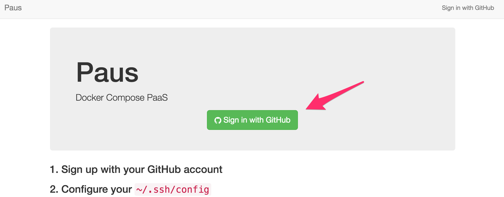
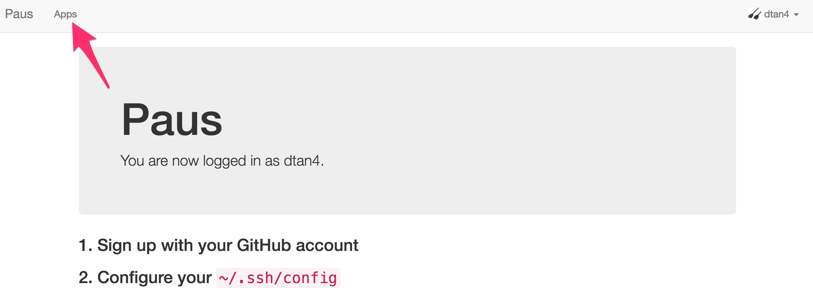
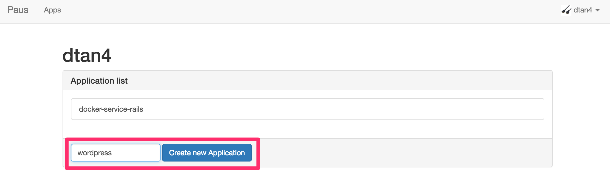

# Paus: Docker Compose PaaS

_Bring your app to the cloud easily._

Deploy application by 2 steps:

- Prepare `docker-compose.yml` on the repository
- `git push paus master`

That's all. You don't have to learn the platform-specific file anymore.

## Try on local machine with Vagrant

At first, run `script/bootstrap` :rocket:

```bash
$ script/boostrap
```

### Prepare `.env`

Set environment variables in `.env`.

__MUST:__ `PAUS_GITHUB_CLIENT_ID` and `PAUS_GITHUB_CLIENT_SECRET` are required to launch Paus.
Create new OAuth application from [here](https://github.com/settings/applications/new), then write Client ID and Client Secret in `.env`
For Vagrant, callback URL should be "http://paus.dev/oauth/callback".

### Launch Paus

3 CoreOS machines are launched.

``` bash
$ vagrant up
$ vagrant dns --install
$ vagrant dns --start
```

### Sign up & Create application.

Access to http://paus.dev and sign up with your GitHub account.



After that, create application.




### Write `~/.ssh/config`

```
Host paus.dev
  User git
  Port 2222
  IdentityFile ~/.ssh/id_rsa
  StrictHostKeyChecking no
```

## Prepare `docker-compose.yml`

e.g. Wordpress + MySQL

```bash
$ cd /path/to/your/app
$ cat docker-compose.yml
version: '2'
services:
  db:
    image: mysql:5.7
    restart: always
    environment:
      MYSQL_ROOT_PASSWORD: wordpress
      MYSQL_DATABASE: wordpress
      MYSQL_USER: wordpress
      MYSQL_PASSWORD: wordpress

  web:
    depends_on:
      - db
    image: wordpress:latest
    links:
      - db
    ports:
      - "8000:80"
    restart: always
    environment:
      WORDPRESS_DB_HOST: db:3306
      WORDPRESS_DB_PASSWORD: wordpress
```

### Add Git remote repository

```bash
$ git remote add paus git@paus.dev:<username>/<app_name>
```

### Push!

```bash
$ git push paus master
```

### Access to the application

Access to the URL shown the end of deployment.

## Modules

Paus consists of the below modules:

- [__paus-frontend__](https://github.com/dtan4/paus-frontend)
  - Web frontend of Paus
- [__paus-gitreceive__](https://github.com/dtan4/paus-gitreceive)
  - Git server of Paus

## Presentation material
- [Docker Compose PaaS の作り方、そして社内に導入した話 / #yapc8oji // Speaker Deck](https://speakerdeck.com/dtan4/number-yapc8oji) (in Japanese)
  - 2016-07-03 YAP(achimon)C::Asia Hachioji 2016 mid in Shinagawa
